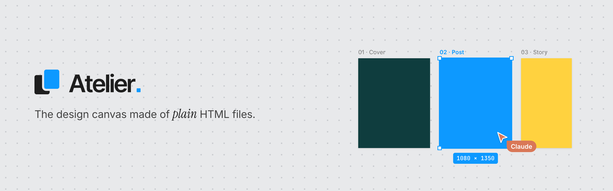
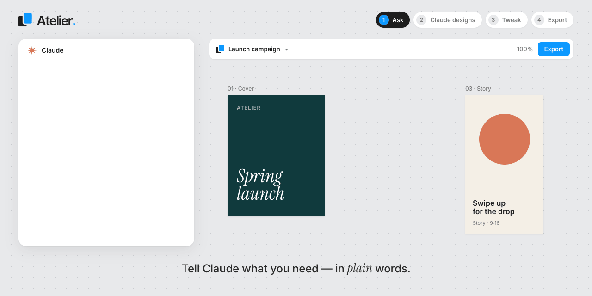
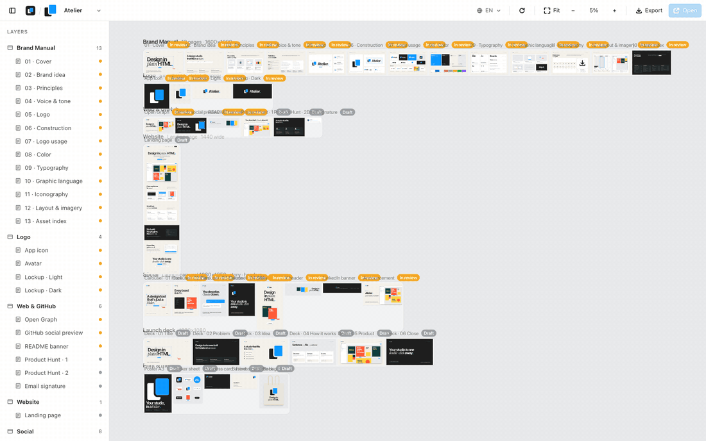

<p align="center"></p>

# Atelier

A static, multi-project, Figma-style design canvas. Every board is an HTML file (or an image) placed on an infinite plane with pan, zoom, layers and selection.

<p align="center"></p>

<p align="center"></p>

## Quick start

Needs [Python 3](https://www.python.org/downloads/) and Chrome (or Chromium, Edge, Brave) for exports. No build, no dependencies.

```
git clone https://github.com/mattqdev/Atelier.git
cd Atelier
python3 atelier.py --install-launcher
```

That adds an **Atelier** app to your system (macOS: `~/Applications`, Linux: applications menu, Windows: Start menu). Click it to start the local server and open the canvas. Then open the folder with [Claude Code](https://claude.com/claude-code) and ask it to design: it writes the boards, Atelier shows them live. No git? Download the zip of the [latest release](https://github.com/mattqdev/Atelier/releases/latest) instead. On Windows use `python` instead of `python3`.

## Using it

- **Open**: double-click `Atelier.html` (works from `file://`, no server or build step).
- **Switch project**: menu in the top bar, or `Atelier.html?p=<id>`.
- **Controls**: drag/scroll to move · ⌘+scroll or pinch to zoom · double-click zooms to a board · Shift/⌘+click multi-select · ⌘A select all · ←/→ browse · Enter opens · Shift+1 fit all · Shift+2 fit selection · ⇧⌘E export · `\` layers.
- **Link to a board**: `Atelier.html?p=<id>&b=<itemId>` (the URL follows the selection).
- **Live reload**: the manifest is re-read every 2 s; bump `rev` on an item to reload its board.

## Viewer

**Open** (or Enter) shows the selected board in `view.html?p=<id>&b=<itemId>`. The board always keeps its aspect ratio: it is shown at 100% and only shrinks when the window is smaller (in full screen it fills the screen).

From the viewer: previous/next (←/→), zoom (+/−, ⌘+scroll, drag to pan), Fit (Shift+1), actual size (Shift+0), background (B: canvas, white, dark, checkerboard), full screen (F), copy link, copy as PNG, open the original file, print / save as PDF (the PDF page matches the board size), export (⇧⌘E).

## Export

Like Figma: pick the boards (single, multiple, whole sections or everything) and one or more export settings:

| Setting | Values |
|---|---|
| Scale | `0.5x` … `4x`, or a target size: `512w` (width), `1080h` (height) |
| Suffix | appended to the file name; empty = `@2x` for scaled exports |
| Format | PNG, JPG, WEBP (with quality 1–100), PDF (vector, original size) |

One file downloads as-is; several are bundled into `<project>.zip`. Settings are remembered.

Exports are rendered by headless Chrome, so they match the browser exactly. That needs the local server (Python 3, standard library only):

```
python3 atelier.py              # http://localhost:4747/Atelier.html, opens the browser
python3 atelier.py --port 8000 --no-open
```

Chrome/Chromium/Edge/Brave are auto-detected; set `ATELIER_CHROME=/path/to/chrome` otherwise. Everything else keeps working from `file://` without the server.

### One-click launcher

```
python3 atelier.py --install-launcher
```

Creates an **Atelier** app bound to this folder: `~/Applications/Atelier.app` on macOS (drag it to the Dock or open it from Spotlight), an applications-menu entry on Linux, a Start menu shortcut on Windows (pin it to the taskbar). One click starts the server in the background if it isn't running and opens Atelier in the browser. Run the command again if you move the folder. On macOS the server log is `~/Library/Logs/Atelier.log`; stop the server with `pkill -f atelier.py`.

## Projects

```
projects/index.js          registry: window.ATELIER_PROJECTS = [{ id, name }]
projects/<id>/manifest.js  project sections and boards (window.WORKSPACE)
projects/<id>/boards/      HTML boards
projects/<id>/assets/      css, logo, fonts
```

Projects are local and not versioned (`projects/*` is in `.gitignore`), except `projects/example/`. To create one: copy `projects/example/`, rename it, register it in `projects/index.js`. Without `projects/index.js` Atelier opens the example project.

## Brand

Logo and launch assets live in [`docs/brand/`](docs/brand): `lockup.svg` / `lockup-white.svg`, `mark.svg` / `mark-white.svg`, `wordmark.svg`, `app-icon.svg` (also `app/atelier.svg`, the favicon), PNG renders (`app-icon-1024.png`, `lockup.png`, `lockup-dark.png`), `og-image.png` (1200×630) and `social-preview.png` (1280×640, for the GitHub repository settings). Please don't redraw, recolour or retype the logo.

## Contributing

See [CONTRIBUTING.md](CONTRIBUTING.md) for the ground rules and how to open a PR, and [CLAUDE.md](CLAUDE.md) for the structure, conventions (i18n, manifest fields) and how to verify changes.

Please read the [Code of Conduct](CODE_OF_CONDUCT.md). Report security issues privately as described in [SECURITY.md](SECURITY.md); questions and ideas go to [Discussions](https://github.com/mattqdev/atelier/discussions).

## License

[MIT](LICENSE) © 2026 MattQ
